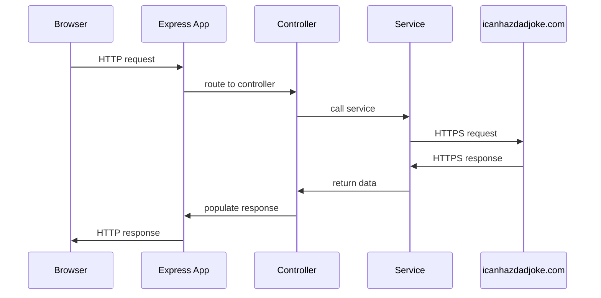
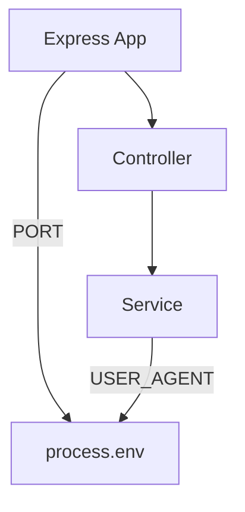
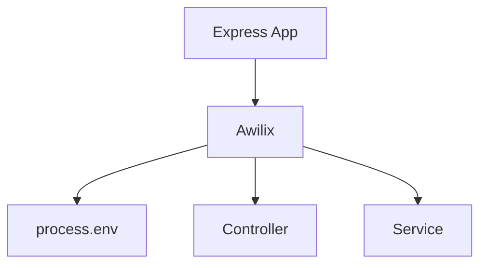

# Awilix Demo

This repository contains a simple demonstration of Awilix dependency injection in a Node.js application. It shows how to:

- set up a container
- retrieve the container and resolve dependencies from it directly
- use an injected container proxy to retrieve dependencies

## Overview

This simple demo consists of a web application with a single endpoint that retrieves a random dad joke from [icanhazdadjoke.com](https://icanhasdadjoke.com). The sequence diagram below describes the flow of a request through the application:



This diagram shows the dependencies between the components of the application:



There are several instances of tight coupling here:

- The Express app is tightly coupled to the controller and to `process.env` (to get the port number).
- The controller is tightly coupled to the service.
- The service is tightly coupled to `process.env` to retrieve the user agent string.

The diagram below shows the same application, now using Awilix for dependency injection:



The tight coupling between components is gone. The Express app kicks off the initialization of the Awilix container, which is responsible for retrieving environment variables and instantiating the controller and service. The Express app, controller, service, and environment variable store all know nothing about one another's implementations.

See the comments in the source files for details. There is lots more Awilix can do; see the [official documentation](https://github.com/jeffijoe/awilix) to learn more.

## Running the Demo

Clone the repository and install dependencies:

```bash
git clone git@github.com:rjwut/awilix-demo.git
npm install
```

Create a `.env` file in the root of the project with the following content:

```txt
PORT=<desired port number; e.g. 3000>
USER_AGENT=<your user agent string>
```

The user agent string is passed to the icanhazdadjoke.com API. It's polite to include your contact info so they can reach out if you're doing something harmful to their service.

Then start the server:

```bash
npm start
```

When the server is running, it will print out the endpoint URL that you can hit to get a random dad joke.
